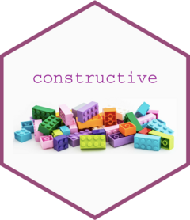

<!-- README.md is generated from README.Rmd. Please edit that file -->
# constructive <a href="https://cynkra.github.io/constructive/"></a>

{constructive} prints code that can be used to recreate R objects. In a
sense it is similar to `base::dput()` or `base::deparse()` but
{constructive} strives to use idiomatic constructors (`factor` for
factors, `as.Date()` for dates, `data.frame()` for data frames etc), in
order to get output readable by humans.

Some use cases are:

- Snapshot tests
- Exploring objects (alternative to `dput()` or `str()`)
- Creating reproducible examples from existing data
- Comparing two objects (using `construct_diff()`)

## Installation

Install the last stable version from CRAN:

``` r
install.packages('constructive')
```

Or install the development version from [cynkra
R-universe](https://cynkra.r-universe.dev):

``` r
install.packages('constructive', repos = c('https://cynkra.r-universe.dev', 'https://cloud.r-project.org'))
```

Or directly from github:

    pak::pak("cynkra/constructive")

## Comparison with `dput()`

A few examples compared to their `dput()` output.

``` r
library(constructive)

construct(head(iris, 2))
#> data.frame(
#>   Sepal.Length = c(5.1, 4.9),
#>   Sepal.Width = c(3.5, 3),
#>   Petal.Length = c(1.4, 1.4),
#>   Petal.Width = c(0.2, 0.2),
#>   Species = factor(c("setosa", "setosa"), levels = c("setosa", "versicolor", "virginica"))
#> )

dput(head(iris, 2))
#> structure(list(Sepal.Length = c(5.1, 4.9), Sepal.Width = c(3.5, 
#> 3), Petal.Length = c(1.4, 1.4), Petal.Width = c(0.2, 0.2), Species = structure(c(1L, 
#> 1L), levels = c("setosa", "versicolor", "virginica"), class = "factor")), row.names = 1:2, class = "data.frame")

construct(.leap.seconds)
#> as.POSIXct(
#>   c(
#>     "1972-07-01", "1973-01-01", "1974-01-01", "1975-01-01", "1976-01-01",
#>     "1977-01-01", "1978-01-01", "1979-01-01", "1980-01-01", "1981-07-01",
#>     "1982-07-01", "1983-07-01", "1985-07-01", "1988-01-01", "1990-01-01",
#>     "1991-01-01", "1992-07-01", "1993-07-01", "1994-07-01", "1996-01-01",
#>     "1997-07-01", "1999-01-01", "2006-01-01", "2009-01-01", "2012-07-01",
#>     "2015-07-01", "2017-01-01"
#>   ),
#>   tz = "GMT"
#> )

dput(.leap.seconds)
#> structure(c(78796800, 94694400, 126230400, 157766400, 189302400, 
#> 220924800, 252460800, 283996800, 315532800, 362793600, 394329600, 
#> 425865600, 489024000, 567993600, 631152000, 662688000, 709948800, 
#> 741484800, 773020800, 820454400, 867715200, 915148800, 1136073600, 
#> 1230768000, 1341100800, 1435708800, 1483228800), class = c("POSIXct", 
#> "POSIXt"), tzone = "GMT")

library(dplyr, warn.conflicts = FALSE)
grouped_band_members <- group_by(band_members, band)

dput(grouped_band_members)
#> structure(list(name = c("Mick", "John", "Paul"), band = c("Stones", 
#> "Beatles", "Beatles")), class = c("grouped_df", "tbl_df", "tbl", 
#> "data.frame"), row.names = c(NA, -3L), groups = structure(list(
#>     band = c("Beatles", "Stones"), .rows = structure(list(2:3, 
#>         1L), ptype = integer(0), class = c("vctrs_list_of", "vctrs_vctr", 
#>     "list"))), class = c("tbl_df", "tbl", "data.frame"), row.names = c(NA, 
#> -2L), .drop = TRUE))

construct(grouped_band_members)
#> tibble::tibble(name = c("Mick", "John", "Paul"), band = c("Stones", "Beatles", "Beatles")) |>
#>   dplyr::group_by(band)
```

We can provide to the `data` argument a named list, an environment, a
package where to look for data, or an unnamed list of such items, so we
don’t print more than necessary, for instance improving the previous
example:

``` r
construct(grouped_band_members, data = "dplyr")
#> band_members |>
#>   dplyr::group_by(band)
```

## Customize the output using constructive options

Some objects can be constructed in several ways, for instance a tibble
might be constructed using `tibble::tibble()` or using
`tibble::tribble()`.

The `opts_*()` family of functions provides ways to tweak the output
code, namely setting the constructor itself or options used by the
constructor

``` r
construct(band_members, opts_tbl_df("tribble"))
#> tibble::tribble(
#>   ~name,  ~band,
#>   "Mick", "Stones",
#>   "John", "Beatles",
#>   "Paul", "Beatles",
#> )
construct(band_members, opts_tbl_df("tribble", justify = "right"))
#> tibble::tribble(
#>    ~name,     ~band,
#>   "Mick",  "Stones",
#>   "John", "Beatles",
#>   "Paul", "Beatles",
#> )

r <- as.raw(c(0x68, 0x65, 0x6c, 0x6c, 0x6f))
construct(r)
#> as.raw(c(0x68, 0x65, 0x6c, 0x6c, 0x6f))
construct(r, opts_raw(representation = "decimal"))
#> as.raw(c(104, 101, 108, 108, 111))
construct(r, opts_raw("charToRaw"))
#> charToRaw("hello")
```

These functions have their own documentation page and are referenced in
`?construct`.

For every class that doesn’t refer to an internal type a “next”
constructor is available, so we can conveniently explore objects using
lower level constructors.

``` r
construct(band_members, opts_tbl_df("next"))
#> data.frame(name = c("Mick", "John", "Paul"), band = c("Stones", "Beatles", "Beatles")) |>
#>   structure(class = c("tbl_df", "tbl", "data.frame"))

construct(band_members, opts_tbl_df("next"), opts_data.frame("next"))
#> list(name = c("Mick", "John", "Paul"), band = c("Stones", "Beatles", "Beatles")) |>
#>   structure(class = c("tbl_df", "tbl", "data.frame"), row.names = c(NA, -3L))
```

## Other functions

- `construct_multi()` constructs several objects from a named list or an
  environment
- `construct_reprex()` wraps `construct_multi()` and constructs all the
  objects of the local environment, or from the caller environments.
- `construct_dput()` constructs the objects using only low level
  constructors, like `structure()`, `list()`, `c()`, very similarly to
  `base::dput()`
- `construct_base()` constructs the objects using only base R functions.
- `construct_clip()` writes to the clipboard, see also
  ?`constructive-global_options`
- `construct_diff()` highlights the differences in the code used to
  produce 2 objects, it’s an alternative to `waldo::compare()`.
- `construct_dump()` is similar to `base::dump()`, it’s a wrapper around
  `construct_multi()` that writes to a file.
- `construct_signature()` constructs a function signature such as the
  one we see in the “usage” section of a function’s help file. outputs
  the code produced  
- `construct_issues()` is used without arguments to check what were the
  issues encountered with the last reconstructed object, it can also be
  provided a specific constructive object.
- `deparse_call()` is an alternative to `base::deparse()` and
  `rlang::expr_deparse()` that handles additional corner cases and fails
  when encountering tokens other than symbols and syntactic literals .

## Note about environments and external pointers

Environments use reference semantics, they cannot be copied. An attempt
to copy an environment would indeed yield a different environment and
`identical(env, copy)` would be `FALSE` (read more about it in
`?opts_environment`).

In some case we can build code that points to a specific environment,
for instance:

``` r
construct(globalenv())
#> .GlobalEnv
construct(environment(setNames))
#> asNamespace("stats")
```

When it’s not possible we use `constructive::.env()` function for this
purpose.

``` r
e1 <- new.env(parent = .GlobalEnv)
e1$x <- 1
construct(e1)
#> constructive::.env("0x131515348", parents = "global")
```

`constructive::.env()` fetches the environment from its memory address.
The `parents` argument doesn’t do anything, it provides as additional
information the sequence of parents until we reach a special
environment.

This strategy is convenient because it always works, but it’s not
reproducible between sessions as the memory address is not stable.
Moreover it doesn’t tell us anything about the environment’s content.

Depending on what compromise you’re ready to make, you might use
different constructions in `opts_environment()`. For the case above,
choosing `"list2env"` works well :

``` r
construct(e1, opts_environment("list2env"))
#> list2env(list(x = 1), parent = .GlobalEnv)
```

`constructive::.xptr()` is the counterpart of `constructive::.env()` to
construct `"externalptr"` objects from a memory address.

## Extending constructive

You can define your own constructors and methods!

For more information see
`vignette("User-defined-methods-and-constructors", package = "constructive")`
